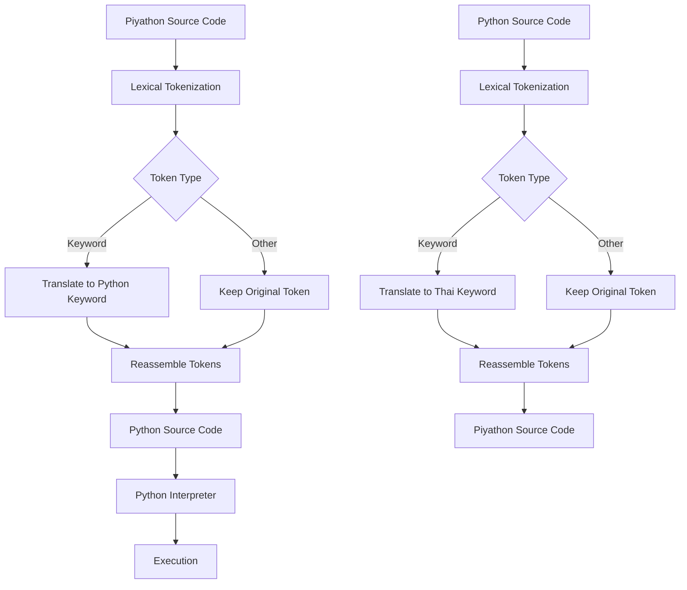
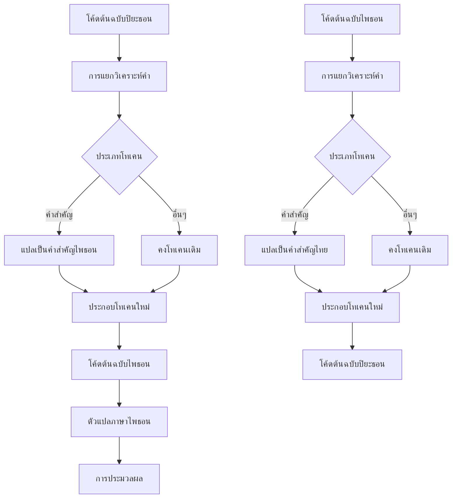
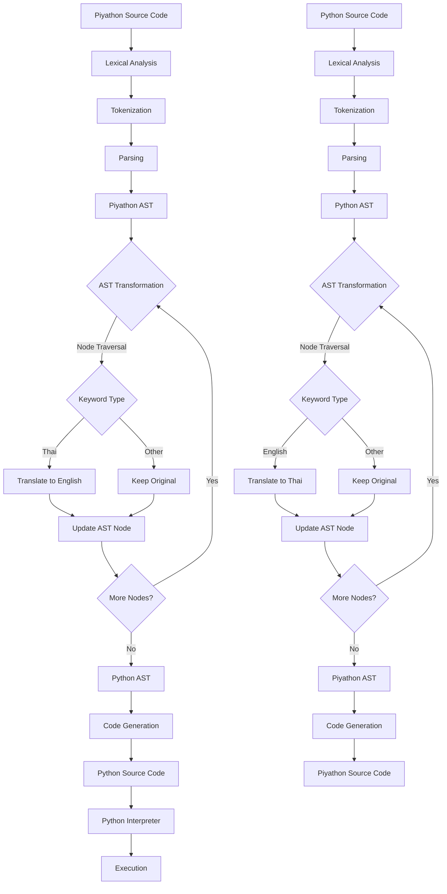
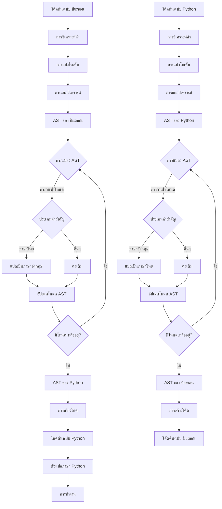

# How Piyathon works

## Without AST

This diagram illustrates the token-based translation approach employed by Piyathon to convert between standard Python and Piyathon code. By using Thai keywords and function names, Piyathon provides a Thai language interface while maintaining full compatibility with Python's syntax and features.

English

Thai

## With AST

English

Thai

